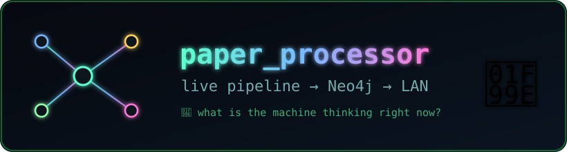
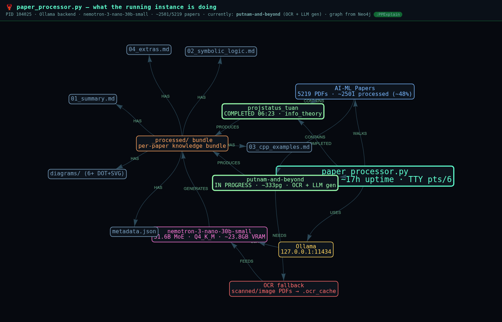

<div align="center">



# paper-processor-neo4j-explain

**Turn a long-running local pipeline into a live, explorable knowledge graph — and host the explanation on your LAN.**

[](https://neo4j.com)
[](https://visjs.github.io/vis-network/)
[](https://ollama.com)
[](https://developer.nvidia.com/nvidia-system-management-interface)
[](#)
[](#)
[](https://www.python.org)
[](web/explanation.html)
[](https://hub.docker.com/_/neo4j)
[](LICENSE)
[](https://claude.com/claude-code)
[](#)

<br>



<sub><i>The live <code>:PPExplain</code> graph served on the LAN — process, backend, model, corpus, current/done papers, the OCR stage, and the per-paper output fan-out.</i></sub>

</div>

---

## 🦞 What is this?

When you kick off a batch job that chews through **thousands of PDFs over many hours**,
`ps aux` tells you it's *alive* — but not what it's *thinking*. This project answers the
real question:

> **"What is the running `paper_processor.py` instance actually doing right now?"**

It does that by materializing the live process's state as a small, labelled **Neo4j
graph** (`:PPExplain`) and rendering it as an interactive **vis-network** page you can
open from any machine on your LAN.

It was born from a real session on host `worlock` inspecting **PID 104025** — an
[OpenClaw/Ollama paper-processing pipeline](docs/2026-06-09T071447Z_running_paper_processor_explained.md)
that was ~48% through a 5,219-PDF corpus, mid-OCR on a 333-page math book.

---

## ✨ Features

- **🔍 Live-process introspection** — derive what a long-running job is doing from
  `/proc`, open sockets, GPU state, and output-directory mtimes.
- **🕸️ Graph-native explanation** — the explanation *is* a Neo4j subgraph
  (`:PPExplain`), isolated from your other data so it's trivially queryable & disposable.
- **🌐 LAN-hosted viz** — a zero-build, single-file HTML page (vis-network via CDN)
  served on `0.0.0.0`, reachable from any device on the subnet.
- **🎨 Neon/black aesthetic** — colour-coded by node `kind` (process, backend, model,
  corpus, paper, output, section, stage).
- **🔁 Reproducible** — one Cypher file + one `serve.sh` rebuild everything.

---

## 🗺️ The explanation graph

```
        (process) paper_processor.py
          │  USES                 │ WALKS
          ▼                       ▼
       (backend) Ollama       (corpus) AI-ML_Papers ──CONTAINS──┐
          │ LOADS                 │ COMPLETED / PROCESSING       │
          ▼                       ▼                              ▼
       (model) nemotron-3-nano-30b   (paper) putnam-and-beyond  (paper) projstatus_tuan
          │ GENERATES               │ NEEDS                      │
          ▼                         ▼                            │
       (output) _processed/ bundle  (stage) OCR fallback ─FEEDS─►(model)
          │ HAS
          ├── 01_summary.md     ├── 03_cpp_examples.md   ├── 04_extras.md
          ├── 02_symbolic_logic ├── diagrams/ (6+ DOT+SVG)└── metadata.json
```

| Node kind | Meaning | Colour |
|-----------|---------|--------|
| `process` | the running pipeline | `#5fffcf` |
| `backend` | inference server (Ollama) | `#ffd45f` |
| `model`   | the loaded LLM | `#ff7ad9` |
| `corpus`  | the PDF tree being walked | `#7ab8ff` |
| `paper`   | an individual document (done / in-progress) | `#9affae` |
| `output`  | the per-paper `_processed/` bundle | `#ffa45f` |
| `section` | a generated artifact | `#7aa0c0` |
| `stage`   | a pipeline stage (e.g. OCR) | `#ff6b6b` |

---

## 🚀 Quick start

### Prerequisites
- A running **Neo4j** (the reference setup uses the `neo4j:latest` Docker image,
  bolt `7687` / http `7474`, auth `neo4j/password123`).
- **Python 3.8+** (stdlib only — no pip installs needed).

### Run

```bash
git clone https://github.com/danindiana/paper-processor-neo4j-explain.git
cd paper-processor-neo4j-explain

# loads graph/pp_explain_graph.cypher into Neo4j, then serves web/ on the LAN
./serve.sh
```

Then open the printed **LAN** URL, e.g. `http://192.168.1.85:8686/explanation.html`.

### Configuration (env vars)

| Var | Default | Purpose |
|-----|---------|---------|
| `PORT` | `8686` | HTTP port for the viz |
| `NEO4J_URL` | `http://127.0.0.1:7474` | Neo4j HTTP endpoint |
| `NEO4J_USER` | `neo4j` | Neo4j username |
| `NEO4J_PASS` | `password123` | Neo4j password |

> **Firewall (UFW):** to expose the port to the LAN only:
> ```bash
> sudo ufw allow from 192.168.1.0/24 to any port 8686 proto tcp comment 'pp explanation viz (LAN only)'
> ```

---

## 🧰 How it works

1. **Inspect** the live process — `/proc/<pid>/{cmdline,cwd,fd}`, `ss -tnp` for the
   Ollama socket, `nvidia-smi` for GPU state, and `find _processed -newermt` to see
   which paper is currently being written.
2. **Model** those facts as nodes/edges in [`graph/pp_explain_graph.cypher`](graph/pp_explain_graph.cypher).
3. **Load** into Neo4j via the HTTP transactional endpoint and **export** to
   [`graph/pp_explain_graph.json`](graph/pp_explain_graph.json).
4. **Render** with [`web/explanation.html`](web/explanation.html) — a single file that
   fetches the JSON and draws it with vis-network.

Re-run the inspection and re-`CREATE` the `:PPExplain` nodes whenever you want a fresh
snapshot — the Cypher begins with `MATCH (n:PPExplain) DETACH DELETE n` so it's idempotent.

---

## 📂 Layout

```
.
├── assets/logo.svg                 # the neon constellation wordmark
├── graph/
│   ├── pp_explain_graph.cypher     # idempotent loader (:PPExplain)
│   └── pp_explain_graph.json       # exported nodes/edges for the viz
├── web/
│   ├── explanation.html            # single-file vis-network dashboard
│   └── pp_explain_graph.json       # served copy
├── docs/
│   └── 2026-06-09T...explained.md  # the originating session write-up
└── serve.sh                        # load graph + host on LAN
```

---

## 🧩 Querying it yourself

```cypher
// everything in the explanation
MATCH (n:PPExplain) RETURN n;

// what is currently being processed and which stages it needs
MATCH (p:PPExplain {kind:'paper'})-[:NEEDS]->(s) RETURN p.name, s.name;

// the full output-bundle fan-out
MATCH (:PPExplain {kind:'output'})-[:HAS]->(sec) RETURN sec.name ORDER BY sec.name;
```

---

## 📜 License

[MIT](LICENSE) © danindiana

<div align="center">
<sub>🦞 Built on <b>worlock</b> with <a href="https://claude.com/claude-code">Claude Code</a> — because a process you can <i>see</i> is a process you can trust.</sub>
</div>
