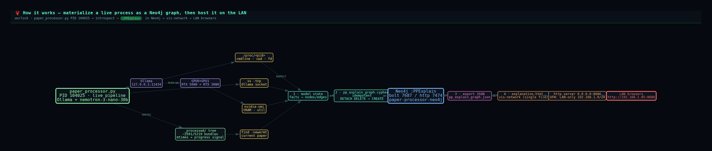

# paper_processor_runtime — snapshot of the live pipeline & tooling

This folder is a point-in-time snapshot (2026-06-09) of the actual files behind the
**running `paper_processor.py` instance** (PID 104025 on host `worlock`) that the
parent repo's `:PPExplain` graph describes. Captured so the explanation graph is
reproducible against the real source, not just a diagram.

## How it works

The live process is introspected, its state materialized as a small labelled Neo4j
graph (`:PPExplain`), and rendered as an interactive vis-network page hosted on the LAN.
The diagram below (itself a vis-network graph — see [`how_it_works.html`](how_it_works.html))
shows the full flow:



```
paper_processor.py (PID 104025)        ┌─ /proc/<pid>   ┐
  ├─ USES → Ollama → GPU0+GPU1   ──────┤  ss -tnp        ├─ INSPECT ─→ ① model state
  └─ WRITES → _processed/ tree   ──────┤  nvidia-smi     │              (facts → nodes/edges)
                                       └─ find -newermt ─┘                     │ EMIT
                                                                               ▼
  LAN browsers ←─ http.server :8686 ←─ ④ explanation.html ←─ ③ export JSON ←─ Neo4j :PPExplain
   (192.168.1.85)     (UFW LAN-only)      (vis-network)      (pp_explain.json)   ▲ LOAD
                                                                                 └─ ② pp_explain_graph.cypher
```

## The pipeline

| File | Role |
|------|------|
| `paper_processor.py` | OpenClaw/Ollama AI-ML paper-processing pipeline. For each PDF, emits `01_summary.md`, `02_symbolic_logic.md`, `03_cpp_examples.md`, `diagrams/` (Graphviz DOT+SVG), `04_extras.md`, `metadata.json`. |
| `ocr_fallback.py` | Local-first OCR fallback (PyMuPDF + Tesseract) for scanned / image-only PDFs; results cached in `.ocr_cache/`. |
| `requirements.txt` | Python dependencies. |

Run (as the live instance does):

```bash
python paper_processor.py                          # all papers, ollama backend
python paper_processor.py --model deepseek-r1:14b  # force a model
python paper_processor.py --list                   # status table
```

## neo4j_viz/ — the dashboard & graph tooling

| File | Role |
|------|------|
| `server.py` | Threaded HTTP dashboard on `0.0.0.0:8585`; streams `_processed/` assets and exposes `/api/sync`, `/api/export`, `/api/active_datasets`. |
| `neo4j_importer.py` | Walks `_processed/` and imports papers/sections into Neo4j. |
| `compute_layout.py` | Precomputes graph layout coordinates. |
| `docker-compose.yml` | The `paper-processor-neo4j` container (bolt 7687 / http 7474, `neo4j/password123`). |

> ⚠️ These are a **reference snapshot**, not a live-tracked submodule. The authoritative
> copies live in the `paper_processor` working tree on `worlock`; re-snapshot if they drift.
